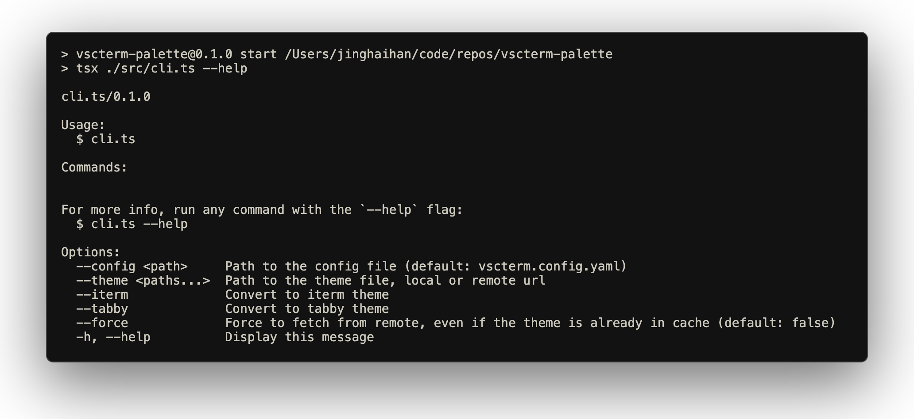

# Vscterm Palette

[![npm version][npm-version-src]][npm-version-href]
[![bundle][bundle-src]][bundle-href]
[![JSDocs][jsdocs-src]][jsdocs-href]
[![License][license-src]][license-href]

🎨 A CLI tool that converts VSCode themes to terminal color schemes for iTerm2 and Tabby.

<p align='center'>

</p>

## What is this?

Vscterm Palette helps you bring your favorite VSCode themes to your terminal. Instead of manually configuring terminal colors to match your VSCode theme, this tool automatically extracts the color palette from VSCode themes and converts them into formats that your terminal can use.

## Features

- **Convert VSCode themes to iTerm2 themes** - Generate `.itermcolors` files that you can import into iTerm2
- **Convert VSCode themes to Tabby themes** - Create YAML theme files for the Tabby terminal
- **Support for remote themes** - Convert themes directly from GitHub URLs
- **Automatic Tabby config updates** - Optionally update your Tabby configuration file

## Quick Start

### Convert a single theme

```bash
# Convert to both formats
npx vscterm-palette --theme https://github.com/antfu/vscode-theme-vitesse/blob/main/themes/vitesse-dark.json --iterm --tabby
```

### Convert multiple themes using a config file

Create a `vscterm.config.yaml` file:

```yaml
themes:
  - 'https://github.com/antfu/vscode-theme-vitesse/blob/main/themes/vitesse-dark.json'
  - 'https://github.com/antfu/vscode-theme-vitesse/blob/main/themes/vitesse-light.json'
  - 'https://github.com/antfu/vscode-theme-vitesse/blob/main/themes/vitesse-black.json'

tabbyConfig: /path/to/your/tabby/config.yaml
```

Then run:

```bash
# Convert all themes to both formats
npx vscterm-palette --iterm --tabby
```

## Output

### iTerm2 Themes

Generated `.itermcolors` files can be imported into iTerm2:

1. Open iTerm2
2. Go to Preferences → Profiles → Colors
3. Click "Color Presets" → "Import..."
4. Select the generated `.itermcolors` file
5. Apply the theme

### Tabby Themes

For Tabby themes, you have two options:

**Manual way:**
1. Go to "Config file", Click "Show Config File"
2. Modify the config.yaml file to use the generated theme

**Automatic way:**
1. Configure the `tabbyConfig` path in your `vscterm.config.yaml`
2. The CLI will automatically update your Tabby configuration file

## License

[MIT](./LICENSE) License © [jinghaihan](https://github.com/jinghaihan)

<!-- Badges -->

[npm-version-src]: https://img.shields.io/npm/v/vscterm-palette?style=flat&colorA=080f12&colorB=1fa669
[npm-version-href]: https://npmjs.com/package/vscterm-palette
[npm-downloads-src]: https://img.shields.io/npm/dm/vscterm-palette?style=flat&colorA=080f12&colorB=1fa669
[npm-downloads-href]: https://npmjs.com/package/vscterm-palette
[bundle-src]: https://img.shields.io/bundlephobia/minzip/vscterm-palette?style=flat&colorA=080f12&colorB=1fa669&label=minzip
[bundle-href]: https://bundlephobia.com/result?p=vscterm-palette
[license-src]: https://img.shields.io/badge/license-MIT-blue.svg?style=flat&colorA=080f12&colorB=1fa669
[license-href]: https://github.com/jinghaihan/vscterm-palette/LICENSE
[jsdocs-src]: https://img.shields.io/badge/jsdocs-reference-080f12?style=flat&colorA=080f12&colorB=1fa669
[jsdocs-href]: https://www.jsdocs.io/package/vscterm-palette
